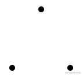
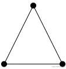

# WebGL 的绘图方式

源码：[github.com/buglas/webg…](https://link.juejin.cn/?target=https%3A%2F%2Fgithub.com%2Fbuglas%2Fwebgl-lesson "https://github.com/buglas/webgl-lesson")

我们先看一下webgl是怎么画图的。

1.绘制多点

2.如果是线，就连点成线

3.如果是面，那就在图形内部，逐片元填色

webgl 的绘图方式就这么简单，接下咱们就说一下这个绘图方式在程序中是如何实现的。

