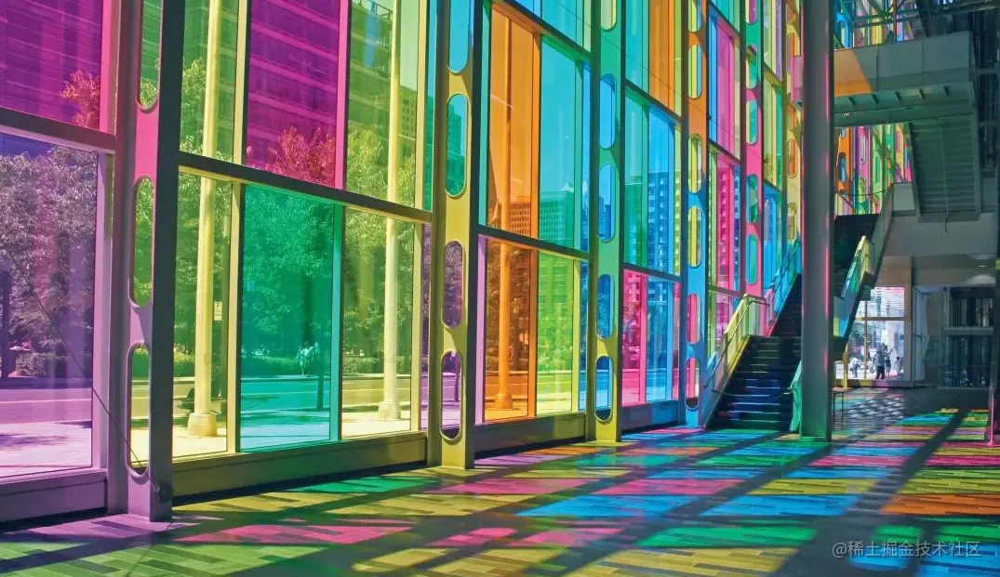
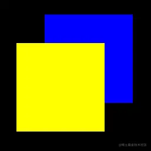
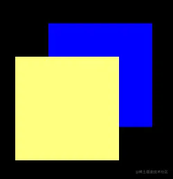
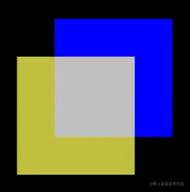
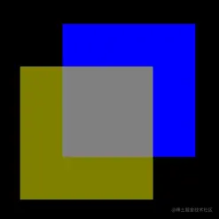
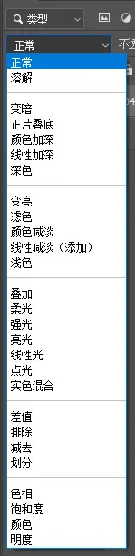
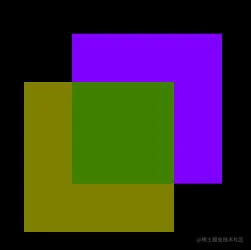

# WebGL颜色合成

---
这是一个五彩缤纷的世界，彩色的玻璃让窗外的风景绚丽夺目。



我们可以把世界想象成一张画布，这个世界里存在着两种风景：

-   source：即将落笔的风景，比如彩色的玻璃。
-   destination：已经落笔的风景，比如窗外的城市。

当这两种风景合到一起后，便会形成新的destination，进入我们的眼睛。

在webgl 中有两种合成颜色的方法：

-   blendFunc(sfactor, dfactor) 基于sfactor, dfactor对source和destination的rgba颜色做合成。
-   blendFuncSeparate(srcRGB, dstRGB, srcAlpha, dstAlpha) 基于srcRGB, dstRGB对source和destination的rgb颜色做合成；基于srcAlpha, dstAlpha对source和destination的alpha透明度做合成。

blendFunc(sfactor, dfactor) 适合对没有透明度的颜色做合成；

blendFuncSeparate(srcRGB, dstRGB, srcAlpha, dstAlpha) 适合对有透明度的颜色做合成。

其中的参数需要按照下面的Constant来写。

| Constant | Factor | Description |
| --- | --- | --- |
| `gl.ZERO` | 0,0,0,0 | 所有颜色乘 0. |
| `gl.ONE` | 1,1,1,1 | 所有颜色乘 1. |
| `gl.SRC_COLOR` | RS, GS, BS, AS | 将所有颜色乘上源颜色。 |
| `gl.ONE_MINUS_SRC_COLOR` | 1-RS, 1-GS, 1-BS, 1-AS | 每个源颜色所有颜色乘 1 . |
| `gl.DST_COLOR` | RD, GD, BD, AD | 将所有颜色与目标颜色相乘。 |
| `gl.ONE_MINUS_DST_COLOR` | 1-RD, 1-GD, 1-BD, 1-AD | 将所有颜色乘以 1 减去每个目标颜色。 |
| `gl.SRC_ALPHA` | AS, AS, AS, AS | 将所有颜色乘以源 alpha 值。 |
| `gl.ONE_MINUS_SRC_ALPHA` | 1-AS, 1-AS, 1-AS, 1-AS | 将所有颜色乘以 1 减去源 alpha 值。 |
| `gl.DST_ALPHA` | AD, AD, AD, AD | 将所有颜色与目标 alpha 值相乘。 |
| `gl.ONE_MINUS_DST_ALPHA` | 1-AD, 1-AD, 1-AD, 1-AD | 将所有颜色乘以 1 减去目标 alpha 值。 |
| `gl.CONSTANT_COLOR` | RC, GC, BC, AC | 将所有颜色乘以一个常数颜色。 |
| `gl.ONE_MINUS_CONSTANT_COLOR` | 1-RC, 1-GC, 1-BC, 1-AC | 所有颜色乘以 1 减去一个常数颜色。 |
| `gl.CONSTANT_ALPHA` | AC, AC, AC, AC | 将所有颜色乘以一个常数。 |
| `gl.ONE_MINUS_CONSTANT_ALPHA` | 1-AC, 1-AC, 1-AC, 1-AC | 所有颜色乘以 1 减去一个常数。 |
| `gl.SRC_ALPHA_SATURATE` | min(AS, 1 - AD), min(AS, 1 - AD), min(AS, 1 - AD), 1 | 将 RGB 颜色乘以源 alpha 值或 1 减去目标 alpha 值中的较小值。alpha 值乘以 1. |

我们详细说一下上面的两个合成方法。

blendFunc(sfactor, dfactor) 的计算原理如下：

```
BlendColor=source*sfactor+destination*dfactor
```

举个例子。

已知：

-   source是(0,0,1,1)
-   destination是(1,1,0,1)
-   sfactor是gl.ONE
-   dfactor是gl.ZERO

求：BlendColor

解：

```
BlendColor=(0,0,1,1)*(1,1,1,1)+(1,1,0,1)*(0,0,0,0)
BlendColor=(0,0,1,1)
```

上面的算法就是常见的颜色覆盖，就像画水粉一样，顶上的source压住下面的dfactor。

我们可以写个webgl测试一下。

```
<!DOCTYPE html>
<html lang="en">
    <head>
        <meta charset="UTF-8" />
        <title>颜色合成</title>
        <style>
            body {
                margin: 0;
                overflow: hidden;
            }
        </style>
    </head>

    <body>
        <canvas id="canvas"></canvas>
        <!-- 顶点着色器 -->
        <script id="vertexShader" type="x-shader/x-vertex">
            attribute vec4 a_Position;
            attribute vec4 a_Color;
            varying vec4 v_Color;
            void main(){
                //点位
                gl_Position=a_Position;
                //尺寸
                gl_PointSize=300.0;
                v_Color=a_Color;
            }
        </script>
        <!-- 片元着色器 -->
        <script id="fragmentShader" type="x-shader/x-fragment">
            precision mediump float;
            varying vec4 v_Color;
            void main(){
                gl_FragColor=v_Color;
            }
        </script>
        <script>
            const canvas = document.querySelector('#canvas')
            canvas.width = window.innerWidth
            canvas.height = window.innerHeight

            // 获取着色器文本
            const vsSource = document.querySelector('#vertexShader').innerText
            const fsSource = document.querySelector('#fragmentShader').innerText

            //三维画笔
            const gl = canvas.getContext('webgl')
            gl.enable(gl.BLEND)
            gl.blendFunc(gl.ONE, gl.ZERO)

            //初始化着色器
            initShaders(gl, vsSource, fsSource)
            //声明颜色 rgba
            gl.clearColor(0, 0, 0, 1)

            //如何向attribute 变量中写入多点，并绘制多点
            //顶点数据
            const vertices = new Float32Array([0, 0.2, -0.2, 0])
            //缓冲对象
            const vertexBuffer = gl.createBuffer()
            //绑定缓冲对象
            gl.bindBuffer(gl.ARRAY_BUFFER, vertexBuffer)
            //写入数据
            gl.bufferData(gl.ARRAY_BUFFER, vertices, gl.STATIC_DRAW)
            //获取attribute 变量
            const a_Position = gl.getAttribLocation(gl.program, 'a_Position')
            //修改attribute 变量
            gl.vertexAttribPointer(a_Position, 2, gl.FLOAT, false, 0, 0)
            //赋能-批处理
            gl.enableVertexAttribArray(a_Position)

            //颜色数据
            const colors = new Float32Array([
                //蓝色
                0, 0, 1, 1,
                //黄色
                1, 1, 0, 1,
            ])
            //缓冲对象
            const colorBuffer = gl.createBuffer()
            //绑定缓冲对象
            gl.bindBuffer(gl.ARRAY_BUFFER, colorBuffer)
            //写入数据
            gl.bufferData(gl.ARRAY_BUFFER, colors, gl.STATIC_DRAW)
            //获取attribute 变量
            const a_Color = gl.getAttribLocation(gl.program, 'a_Color')
            //修改attribute 变量
            gl.vertexAttribPointer(a_Color, 4, gl.FLOAT, false, 0, 0)
            //赋能-批处理
            gl.enableVertexAttribArray(a_Color)

            //刷底色
            gl.clear(gl.COLOR_BUFFER_BIT)

            //绘制顶点
            gl.drawArrays(gl.POINTS, 0, 2)

            // 初始化着色器
            function initShaders(gl, vsSource, fsSource) {
                //创建程序对象
                const program = gl.createProgram()
                //建立着色对象
                const vertexShader = loadShader(gl, gl.VERTEX_SHADER, vsSource)
                const fragmentShader = loadShader(gl, gl.FRAGMENT_SHADER, fsSource)
                //把顶点着色对象装进程序对象中
                gl.attachShader(program, vertexShader)
                //把片元着色对象装进程序对象中
                gl.attachShader(program, fragmentShader)
                //连接webgl上下文对象和程序对象
                gl.linkProgram(program)
                //启动程序对象
                gl.useProgram(program)
                //将程序对象挂到上下文对象上
                gl.program = program
                return true
            }
            function createProgram(gl, vsSource, fsSource) {
                //创建程序对象
                const program = gl.createProgram()
                //建立着色对象
                const vertexShader = loadShader(gl, gl.VERTEX_SHADER, vsSource)
                const fragmentShader = loadShader(gl, gl.FRAGMENT_SHADER, fsSource)
                //把顶点着色对象装进程序对象中
                gl.attachShader(program, vertexShader)
                //把片元着色对象装进程序对象中
                gl.attachShader(program, fragmentShader)
                //连接webgl上下文对象和程序对象
                gl.linkProgram(program)
                return program
            }

            function loadShader(gl, type, source) {
                //根据着色类型，建立着色器对象
                const shader = gl.createShader(type)
                //将着色器源文件传入着色器对象中
                gl.shaderSource(shader, source)
                //编译着色器对象
                gl.compileShader(shader)
                //返回着色器对象
                return shader
            }
        </script>
    </body>
</html>
```

效果如下：



那如果黄色是半透明的会怎么样呢？

改下代码：

```
const colors = new Float32Array([
    //蓝色
    0, 0, 1, 1,
    //黄色
    // 1, 1, 0, 1,
    // 半透明的黄
    1, 1, 0, 0.5,
])
```

效果如下：



相信你可以看出，黄色变淡了。

这是为什么呢？用之前的公式印证一番即可：

```
BlendColor=(0,0,1,0.5)*(1,1,1,1)+(1,1,0,1)*(0,0,0,0)
BlendColor=(0,0,1,0.5)
```

由上可知，合成颜色的透明度变了。

但为什么合成颜色的透明度变了会导致颜色变淡呢？

这跟webgl颜色与canvas画布背景色的合成方式有关，其具体算法我先不细说，大家先知道颜色的透明度会影响颜色的最终渲染效果即可。

接下来，我们还要解决一个问题。

既然黄色半透明了，那黄色与蓝色相交的部分就应该有所变化。

这样我们就得换一套合成因子了：

```
gl.blendFunc(gl.SRC_ALPHA, gl.ONE_MINUS_SRC_ALPHA)
```

效果如下：



其算法如下：

```
BlendColor=(0,0,1,0.5)*0.5+(1,1,0,1)*(1-0.5)
BlendColor=(0,0,0.5,0.25)+(0.5,0.5,0,0.5)
BlendColor=(0.5,0.5,0.5,0.75)
```

通过上面的算法可以看到合成颜色变灰了。

但同时也出现了一个问题：合成区域的透明度变低了。

一个半透明的图像合上一个不透明的图像后，其透明度是不可能降低的。

因此，这个透明度需要与rgb分开计算。

webgl就提供了一个这样的方法-blendFuncSeparate(srcRGB, dstRGB, srcAlpha, dstAlpha)。

改一下代码，把之前的blendFunc()方法改成blendFuncSeparate()方法。

```
gl.blendFuncSeparate(gl.SRC_ALPHA, gl.ONE_MINUS_SRC_ALPHA, gl.ONE, gl.ONE)
```

效果如下：



现在的合成颜色就明显比之前颜色暗了。

看一下其算法：

```
BlendColor.rgb=(0,0,1)*0.5+(1,1,0)*(1-0.5)
BlendColor.rgb=(0,0,0.5)+(0.5,0.5,0)
BlendColor.rgb=(0.5,0.5,0.5)
BlendColor.a=0.5*1+1*1
BlendColor.a=1.5=1
```

因为透明度的极大值就是1，所以1.5 的透明度依旧是1。

现在关于blendFunc()和blendFuncSeparate()的常规用法，我们就说完了。

我们还可以在其中写入其它的constant，让图像出现不同的合成效果，其作用，大家可以联想一下photoshop里的合成方式：



具体我就不给大家写了，接下来再聊点其它的相关方法。

我们之前在合成source和destination的时候，用的是加法。

```
BlendColor=source*sfactor+destination*dfactor
```

其实，我们也可以用减法。

[blendEquation](https://link.juejin.cn/?target=https%3A%2F%2Fdeveloper.mozilla.org%2Fen-US%2Fdocs%2FWeb%2FAPI%2FWebGLRenderingContext%2FblendEquation "https://developer.mozilla.org/en-US/docs/Web/API/WebGLRenderingContext/blendEquation")(mode)：blendFunc()方法中source和destination的合成方式。

-   gl.FUNC\_ADD: source + destination (default value)
-   gl.FUNC\_SUBTRACT: source - destination
-   gl.FUNC\_REVERSE\_SUBTRACT: destination - source
-   gl.MIN: Minimum of source and destination
-   gl.MAX: Maximum of source and destination

上面的mode我是从MDN里复制粘贴的，英语很好理解，不翻译了。

既然blendFunc()有了一个blendEquation()，那blendFuncSeparate()也自然有一个blendEquationSeparate()。

blendEquationSeparate(modeRGB, modeAlpha)：对应blendFuncSeparate()中rgb和a的两种合成方式，其中的参数类型与blendEquation()一样。

在代码里测试一下。

```
const gl = canvas.getContext('webgl')
gl.enable(gl.BLEND)
// gl.blendFunc(gl.ONE, gl.ZERO)
// gl.blendFunc(gl.SRC_ALPHA, gl.ONE_MINUS_SRC_ALPHA)
gl.blendFuncSeparate(gl.SRC_ALPHA, gl.ONE_MINUS_SRC_ALPHA, gl.ONE, gl.ONE)
gl.blendEquationSeparate(gl.FUNC_SUBTRACT, gl.FUNC_ADD)
```

为了方便看减法效果，把蓝色的点改成紫色。

```
const colors = new Float32Array([
    //蓝色
    // 0, 0, 1, 1,
    // 紫色
    0.5, 0, 1, 1,
    //黄色
    // 1, 1, 0, 1,
    // 半透明的黄
    1, 1, 0, 0.5,
])
```

效果如下：



相关算法就不写了，理解这个功能就好，免得在three.js的合成里的遇到一堆没见过的单词。

参考链接：

[wgld.org/d/webgl/w02…](https://link.juejin.cn/?target=https%3A%2F%2Fwgld.org%2Fd%2Fwebgl%2Fw029.html "https://wgld.org/d/webgl/w029.html")

[wgld.org/d/webgl/w03…](https://link.juejin.cn/?target=https%3A%2F%2Fwgld.org%2Fd%2Fwebgl%2Fw030.html "https://wgld.org/d/webgl/w030.html")
