# WebGL模板缓冲区

---
### 课程目标

-   理解Stencil Buffer 的概念
-   掌握Stencil Buffer 的用法

## 1-stencil buffer简介

Stencil的本意是模板，即有镂空图案的板子。

stencil buffer 就是模板缓冲区的意思，这是一个存储着模板数据的缓冲区。

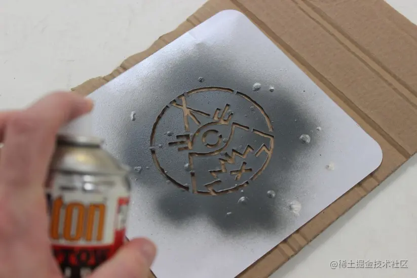

图片来自：[gomedia.com/zine/tutori…](https://link.juejin.cn/?target=http%3A%2F%2Fgomedia.com%2Fzine%2Ftutorials%2Fhow-to-design-occult-looking-band-logo%2F "http://gomedia.com/zine/tutorials/how-to-design-occult-looking-band-logo/")

在上图中，如果没有模板，喷枪中的颜料会直接喷到画布上。

有了镂空的模板后，便可以对颜料进行过滤，从而喷出特定的图案。

Stencil buffer会为每个fragment提供8位的存储空间，在其中可以写入\[0,255\]的数字。

其实要实现上图那样的简单效果，1位0和1就够了。

我们通过下面的示意图具体说一下这个逻辑。

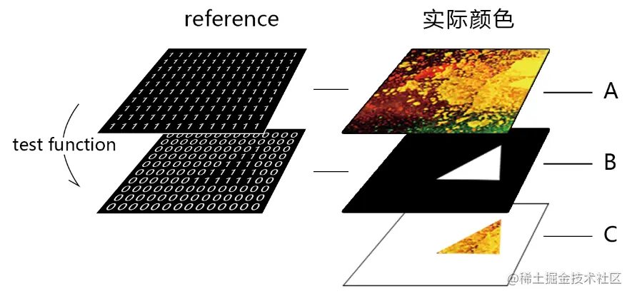

-   A：要喷绘的颜色
-   B：模板
-   C：模板过滤出的图像

由此我们可以思考一下用模板绘图的逻辑。

1.准备一张模板。这张模板上需要有一堆参考数据reference。

2.喷涂颜色，喷涂之前要指定参考值reference和模板测试方法，这里的reference会与模板的reference做模板测试。

## 2-stencil buffer的使用

在stencil buffer相关操作中，有两个很重要的方法：gl.stencilFunc()、gl.stencilOp()。

stencilFunc(func, ref, mask) 设置模板测试函数、参考值和掩码。

-   func 测试函数，默认gl.ALWAYS。
    
    下面是其可以取的值，拷贝自MDN，英语很简单，不翻译了。
    
    -   gl.NEVER: Never pass.
    -   gl.LESS: Pass if (ref & mask) < (stencil & mask).
    -   gl.EQUAL: Pass if (ref & mask) = (stencil & mask).
    -   gl.LEQUAL: Pass if (ref & mask) <= (stencil & mask).
    -   gl.GREATER: Pass if (ref & mask) > (stencil & mask).
    -   gl.NOTEQUAL: Pass if (ref & mask) !== (stencil & mask).
    -   gl.GEQUAL: Pass if (ref & mask) >= (stencil & mask).
    -   gl.ALWAYS: Always pass.
-   ref 用于指定模板测试的参考值。默认值为0。
    
-   mask 指定一个逐位掩码，用于在测试完成时对参考值和存储的模板值进行AND运算。默认值为1。
    

stencilOp(fail, zfail, zpass)：指定通过测试和未通过测试时要怎么处理。

-   fail 模板测试失败时要使用的函数。默认值为gl.KEEP。
-   zfail 模板测试通过但深度测试失败时要使用的函数。默认值为gl.KEEP。
-   zpass 模板测试和深度测试都通过时，或者模板测试通过且深度缓冲区无效时要使用的函数。默认值为gl.KEEP。

上面参数可以写入以下值：

-   gl.KEEP 保持当前值。
-   gl.ZERO 将模板缓冲区值设置为0。
-   gl.REPLACE 将模板缓冲区值设置为WebGLRenderingContext.stencilFunc()里的reference。
-   gl.INCR 增加当前模板缓冲区值。最大为unsigned 值。
-   gl.INCR\_WRAP 增加当前模板缓冲区值。 增加到unsigned 值时，模板缓冲区的值为零。
-   gl.DECR 减小当前模板缓冲区的值。最小为0。
-   gl.DECR\_WRAP 减小当前模板缓冲区的值。减小到0时，模板缓冲区的值为unsigned 值。
-   gl.INVERT 逐位反转当前模板缓冲区值。

接下来我们举个简单的例子。

我要透过一个圆形的遮罩画一个圆，效果如下：

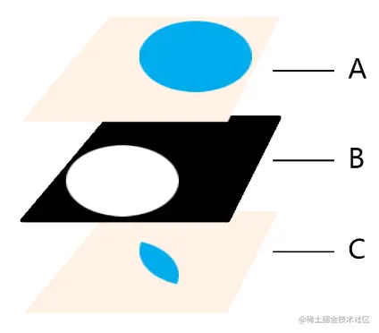

-   A：要喷绘的颜色
-   B：模板
-   C：模板过滤出的图像

其整体代码如下：

```
<!DOCTYPE html>
<html lang="en">
    <head>
        <meta charset="UTF-8" />
        <title>颜色合成</title>
        <style>
            body {
                margin: 0;
                overflow: hidden;
            }
        </style>
    </head>

    <body>
        <canvas id="canvas"></canvas>
        <!-- 顶点着色器 -->
        <script id="vertexShader" type="x-shader/x-vertex">
            attribute vec4 a_Position;
            void main(){
                 //点位
                 gl_Position=a_Position;
                 //尺寸
                 gl_PointSize=300.0;
            }
        </script>
        <!-- 片元着色器 -->
        <script id="fragmentShader" type="x-shader/x-fragment">
            precision mediump float;
            void main(){
                 float dist=distance(gl_PointCoord,vec2(0.5,0.5));
                 if(dist<0.5){
                   gl_FragColor=vec4(0,0.7,0.9,1);
                 }else{
                   discard;
                 }
            }
        </script>
        <script>
            const canvas = document.querySelector('#canvas')
            canvas.width = window.innerWidth
            canvas.height = window.innerHeight

            //三维画笔
            const gl = canvas.getContext('webgl', { stencil: true })
            gl.enable(gl.STENCIL_TEST)

            // 获取着色器文本
            const vsSource = document.querySelector('#vertexShader').innerText
            const fsSource = document.querySelector('#fragmentShader').innerText

            //初始化着色器
            initShaders(gl, vsSource, fsSource)

            // 定义背景色，默认为(0,0,0,0)
            gl.clearColor(1, 0.95, 0.9, 1.0)
            // 定义模板缓冲区的背景值，默认为0，这不是颜色，就是一个模板参考值
            gl.clearStencil(0)
            // 用定义好的背景色理缓冲区
            gl.clear(gl.COLOR_BUFFER_BIT | gl.STENCIL_BUFFER_BIT)

            //获取attribute 变量
            const a_Position = gl.getAttribLocation(gl.program, 'a_Position')
            //缓冲对象
            const vertexBuffer = gl.createBuffer()
            //绑定缓冲对象
            gl.bindBuffer(gl.ARRAY_BUFFER, vertexBuffer)
            //修改attribute 变量
            gl.vertexAttribPointer(a_Position, 2, gl.FLOAT, false, 0, 0)
            //赋能-批处理
            gl.enableVertexAttribArray(a_Position)
            //清空缓冲区
            gl.bindBuffer(gl.ARRAY_BUFFER, null)

            /* 模板 */
            // ALWAYS永远通过测试，1&0xff=1
            gl.stencilFunc(gl.ALWAYS, 1, 0xff)
            // 当模板测试或深度测试失败时，保留模板当前值，即gl.clearStencil(0)中的0；
            // 否则测试都通过，或者模板测试通过且深度缓冲区无效时，取stencilFunc()里的reference，即1。
            gl.stencilOp(gl.KEEP, gl.KEEP, gl.REPLACE)

            //绑定缓冲对象
            gl.bindBuffer(gl.ARRAY_BUFFER, vertexBuffer)
            //写入数据
            gl.bufferData(gl.ARRAY_BUFFER, new Float32Array([0, 0]), gl.STATIC_DRAW)
            //清空缓冲区
            gl.bindBuffer(gl.ARRAY_BUFFER, null)

            //不需要绘制模板
            gl.colorMask(false, false, false, false)
            //绘制顶点
            gl.drawArrays(gl.POINTS, 0, 1)
            // 画完后复原colorMask
            gl.colorMask(true, true, true, true)

            /* 绘图 */
            // 指定接下来要绘制的图形与之前模板之间测试方法，以及参考值
            gl.stencilFunc(gl.EQUAL, 1, 0xff)
            // 反向遮罩
            // gl.stencilFunc(gl.NOTEQUAL, 1, 0xff)

            //绑定缓冲对象
            gl.bindBuffer(gl.ARRAY_BUFFER, vertexBuffer)
            //写入数据
            gl.bufferData(
                gl.ARRAY_BUFFER,
                new Float32Array([0.2, 0.2]),
                gl.STATIC_DRAW
            )
            //清空缓冲区
            gl.bindBuffer(gl.ARRAY_BUFFER, null)

            //绘制顶点
            gl.drawArrays(gl.POINTS, 0, 1)

            // 初始化着色器
            function initShaders(gl, vsSource, fsSource) {
                //创建程序对象
                const program = gl.createProgram()
                //建立着色对象
                const vertexShader = loadShader(gl, gl.VERTEX_SHADER, vsSource)
                const fragmentShader = loadShader(gl, gl.FRAGMENT_SHADER, fsSource)
                //把顶点着色对象装进程序对象中
                gl.attachShader(program, vertexShader)
                //把片元着色对象装进程序对象中
                gl.attachShader(program, fragmentShader)
                //连接webgl上下文对象和程序对象
                gl.linkProgram(program)
                //启动程序对象
                gl.useProgram(program)
                //将程序对象挂到上下文对象上
                gl.program = program
                return true
            }
            function createProgram(gl, vsSource, fsSource) {
                //创建程序对象
                const program = gl.createProgram()
                //建立着色对象
                const vertexShader = loadShader(gl, gl.VERTEX_SHADER, vsSource)
                const fragmentShader = loadShader(gl, gl.FRAGMENT_SHADER, fsSource)
                //把顶点着色对象装进程序对象中
                gl.attachShader(program, vertexShader)
                //把片元着色对象装进程序对象中
                gl.attachShader(program, fragmentShader)
                //连接webgl上下文对象和程序对象
                gl.linkProgram(program)
                return program
            }

            function loadShader(gl, type, source) {
                //根据着色类型，建立着色器对象
                const shader = gl.createShader(type)
                //将着色器源文件传入着色器对象中
                gl.shaderSource(shader, source)
                //编译着色器对象
                gl.compileShader(shader)
                //返回着色器对象
                return shader
            }
        </script>
    </body>
</html>
```

效果如下：

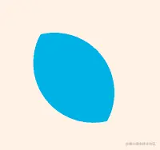

解释一下其原理。

1.圆形是用一点加上距离算法实现的。

```
<!-- 顶点着色器 -->
<script id="vertexShader" type="x-shader/x-vertex">
    attribute vec4 a_Position;
    void main(){
         //点位
         gl_Position=a_Position;
         //尺寸
         gl_PointSize=300.0;
    }
</script>
<!-- 片元着色器 -->
<script id="fragmentShader" type="x-shader/x-fragment">
    precision mediump float;
    void main(){
         float dist=distance(gl_PointCoord,vec2(0.5,0.5));
         if(dist<0.5){
           gl_FragColor=vec4(0,0.7,0.9,1);
         }else{
           discard;
         }
    }
</script>
```

2.在通过canvas获取webgl上下文对象的时候，stencil需要设置为true，并且开启STENCIL\_TEST 模板测试功能。

```
const canvas = document.querySelector('#canvas')
canvas.width = window.innerWidth
canvas.height = window.innerHeight

//三维画笔
const gl = canvas.getContext('webgl', { stencil: true })
gl.enable(gl.STENCIL_TEST)
```

3.初始化着色器。

```
// 获取着色器文本
const vsSource = document.querySelector('#vertexShader').innerText
const fsSource = document.querySelector('#fragmentShader').innerText

//初始化着色器
initShaders(gl, vsSource, fsSource)
```

4.定义背景色和模板值，清理缓冲区。

```
// 定义背景色，默认为(0,0,0,0)
gl.clearColor(1, 0.95, 0.9, 1.0)
// 定义模板缓冲区的背景值，默认为0，这不是颜色，就是一个模板参考值
gl.clearStencil(0)
// 用定义好的背景色理缓冲区
gl.clear(gl.COLOR_BUFFER_BIT | gl.STENCIL_BUFFER_BIT)
```

现在的模板缓冲区里都是0：

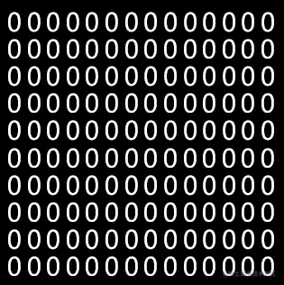

5.获取顶点的attribute 变量，并对其做一下初始化设置。

```
//获取attribute 变量
const a_Position = gl.getAttribLocation(gl.program, 'a_Position')
//缓冲对象
const vertexBuffer = gl.createBuffer()
//绑定缓冲对象
gl.bindBuffer(gl.ARRAY_BUFFER, vertexBuffer)
//修改attribute 变量
gl.vertexAttribPointer(a_Position, 2, gl.FLOAT, false, 0, 0)
//赋能-批处理
gl.enableVertexAttribArray(a_Position)
//清空缓冲区
gl.bindBuffer(gl.ARRAY_BUFFER, null)
```

6.建立一个圆形的模板。

```
// ALWAYS永远通过测试，1&0xff=1
gl.stencilFunc(gl.ALWAYS, 1, 0xff)
// 当模板测试或深度测试失败时，保留模板当前值，即gl.clearStencil(0)中的0；
// 否则测试都通过，或者模板测试通过且深度缓冲区无效时，取stencilFunc()里的reference，即1。
gl.stencilOp(gl.KEEP, gl.KEEP, gl.REPLACE)

//绑定缓冲对象
gl.bindBuffer(gl.ARRAY_BUFFER, vertexBuffer)
//写入数据
gl.bufferData(gl.ARRAY_BUFFER, new Float32Array([0, 0]), gl.STATIC_DRAW)
//清空缓冲区
gl.bindBuffer(gl.ARRAY_BUFFER, null)
```

我们可以画一下看看：

```
gl.drawArrays(gl.POINTS, 0, 1)
```

效果如下：

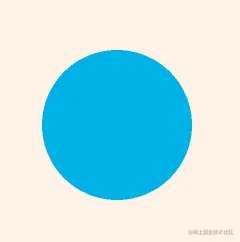

当前的模板缓冲区中，圆内为1，圆外为0：

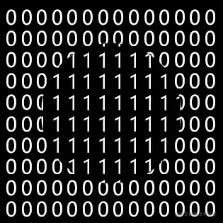

7.我们只需要用gl.drawArrays()方法把模板数据写入模板缓冲区即可，但不需要显示出来，所以得这么做。

```
//不需要绘制模板
gl.colorMask(false, false, false, false)
//绘制顶点
gl.drawArrays(gl.POINTS, 0, 1)
// 画完后复原colorMask
gl.colorMask(true, true, true, true)
```

现在画布中除了浅黄色的背景，啥也木有了：

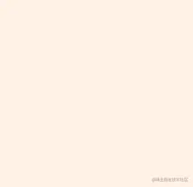

8.再绘制一个蓝色的圆，这个圆是要显示出来的，不再是模板了。

```
// 指定接下来要绘制的图形与之前模板之间测试方法，以及参考值
gl.stencilFunc(gl.EQUAL, 1, 0xff)

//绑定缓冲对象
gl.bindBuffer(gl.ARRAY_BUFFER, vertexBuffer)
//写入数据
gl.bufferData(
gl.ARRAY_BUFFER,
new Float32Array([0.2, 0.2]),
gl.STATIC_DRAW
)
//清空缓冲区
gl.bindBuffer(gl.ARRAY_BUFFER, null)

//绘制顶点
gl.drawArrays(gl.POINTS, 0, 1)
```

stencilFunc()不是模板专有的方法，因为你要画的图形与模板怎么合成，是两方面的事。

所以在正常画图时，也要通过stencilFunc()方法告诉程序对象，你希望它如何与模板打配合。

stencilFunc()中的gl.EQUAL表示当我这里面的reference与模板那里的reference相等时，代表模板测试通过了。

stencilFunc()中的1是要与之前模板里的reference做比较的。

后面没有执行stencilOp()，这是因我们现在不需要再向stencil buffer里写入内容。

现在stencil buffer的基本操作流程就说完了。

我们在画图时，也可以用stencilFunc()方法实现反向遮罩效果。

```
gl.stencilFunc(gl.NOTEQUAL, 1, 0xFF);
```

效果如下：


以此理，我们把蓝色的圆调大一点，并和模板中的圆对齐，便可以实现一个描边效果：

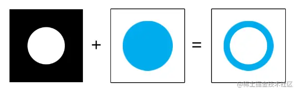

代码我就不写了，感兴趣的话大家可以自己写写试试。

我们在操作深度缓存时，是可以精确到模型的哪一面的，比如正面、反面和双面。

要精确到模型的哪一面，将之前的stencilFunc(func, ref, mask)、stencilOp(fail, zfail, zpass)、stencilMask(mask)替换成stencilFuncSeparate(face, func, ref, mask)、stencilOpSeparate(face, fail, zfail, zpass)、stencilMaskSeparate(face, mask)。

其中的face就指定模型哪一面的，其值可以取 gl.FRONT、gl.BACK和gl.FRONT\_AND\_BACK。

具体我就不再演示了，很简单，大家可以自己试试，若有问题再跟我说。

## 3-多缓冲区

模板是可以进行合成的，比如我可以用两个圆异或出一个模板来：

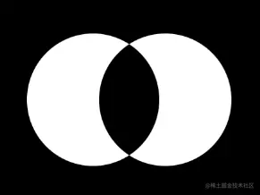

异或是一种运算逻辑，其符号是^。

两个白色的圆是1，相交部分是1^1=0，所以其相交的部分是黑的。

1.模板代码如下：

```
/* ======== 模板1 ======== */
// ALWAYS永远通过测试，1&0xff=1
gl.stencilFunc(gl.ALWAYS, 1, 0xff)
// 当模板测试或深度测试失败时，保留模板当前值，即gl.clearStencil(0)中的0；
// 否则测试都通过，或者模板测试通过且深度缓冲区无效时，取stencilFunc()里的reference，即1。
gl.stencilOp(gl.KEEP, gl.KEEP, gl.REPLACE)

//绑定缓冲对象
gl.bindBuffer(gl.ARRAY_BUFFER, vertexBuffer)
//写入数据
gl.bufferData(
    gl.ARRAY_BUFFER,
    new Float32Array([-0.1, 0]),
    gl.STATIC_DRAW
)
//清空缓冲区
gl.bindBuffer(gl.ARRAY_BUFFER, null)

//不需要绘制模板
gl.colorMask(false, false, false, false)
//绘制顶点
gl.drawArrays(gl.POINTS, 0, 1)
// 画完后复原colorMask
gl.colorMask(true, true, true, true)

/* ======== 模板2 ======== */
gl.stencilFunc(gl.EQUAL, 1, 0xff)
gl.stencilOp(gl.REPLACE, gl.KEEP, gl.INVERT)

gl.bindBuffer(gl.ARRAY_BUFFER, vertexBuffer)
gl.bufferData(gl.ARRAY_BUFFER, new Float32Array([0.1, 0]), gl.STATIC_DRAW)
gl.bindBuffer(gl.ARRAY_BUFFER, null)

gl.colorMask(false, false, false, false)
gl.drawArrays(gl.POINTS, 0, 1)
gl.colorMask(true, true, true, true)
```

模板1和之前一样，我们看模板2.

模板2以1为reference值，若1等于当前模板缓冲区中的reference，则通过模板测试，其值为1的INVERT，即0。否则，若1不等于当前模板缓冲区中的reference，其值去模板2的reference，即1。

按照异或逻辑，模板2的stencilFunc()和stencilOp()也可以这么写：

```
gl.stencilFunc(gl.NOTEQUAL, 1, 0xff)
gl.stencilOp(gl.INVERT, gl.KEEP, gl.REPLACE)
```

2.正常画一个圆：

```
// 指定接下来要绘制的图形与之前模板之间测试方法，以及参考值
gl.stencilFunc(gl.EQUAL, 1, 0xff)

//绑定缓冲对象
gl.bindBuffer(gl.ARRAY_BUFFER, vertexBuffer)
//写入数据
gl.bufferData(
    gl.ARRAY_BUFFER,
    new Float32Array([0, -0.3]),
    gl.STATIC_DRAW
)
//清空缓冲区
gl.bindBuffer(gl.ARRAY_BUFFER, null)

//绘制顶点
gl.drawArrays(gl.POINTS, 0, 1)
```

效果如下：


遮罩原理如下：

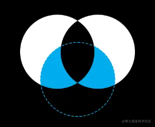

整体代码如下：

```
<!DOCTYPE html>
<html lang="en">
    <head>
        <meta charset="UTF-8" />
        <title>颜色合成</title>
        <style>
            body {
                margin: 0;
                overflow: hidden;
            }
        </style>
    </head>

    <body>
        <canvas id="canvas"></canvas>
        <!-- 顶点着色器 -->
        <script id="vertexShader" type="x-shader/x-vertex">
            attribute vec4 a_Position;
            void main(){
                 //点位
                 gl_Position=a_Position;
                 //尺寸
                 gl_PointSize=300.0;
            }
        </script>
        <!-- 片元着色器 -->
        <script id="fragmentShader" type="x-shader/x-fragment">
            precision mediump float;
            void main(){
                 float dist=distance(gl_PointCoord,vec2(0.5,0.5));
                 if(dist<0.5){
                   gl_FragColor=vec4(0,0.7,0.9,1);
                 }else{
                   discard;
                 }
            }
        </script>
        <script>
            const canvas = document.querySelector('#canvas')
            canvas.width = window.innerWidth
            canvas.height = window.innerHeight

            //三维画笔
            const gl = canvas.getContext('webgl', { stencil: true })
            gl.enable(gl.STENCIL_TEST)

            // 获取着色器文本
            const vsSource = document.querySelector('#vertexShader').innerText
            const fsSource = document.querySelector('#fragmentShader').innerText

            //初始化着色器
            initShaders(gl, vsSource, fsSource)

            // 定义背景色，默认为(0,0,0,0)
            gl.clearColor(1, 0.95, 0.9, 1.0)
            // 定义模板缓冲区的背景值，默认为0，这不是颜色，就是一个模板参考值
            gl.clearStencil(0)
            // 用定义好的背景色理缓冲区
            gl.clear(gl.COLOR_BUFFER_BIT | gl.STENCIL_BUFFER_BIT)

            //获取attribute 变量
            const a_Position = gl.getAttribLocation(gl.program, 'a_Position')
            //缓冲对象
            const vertexBuffer = gl.createBuffer()
            //绑定缓冲对象
            gl.bindBuffer(gl.ARRAY_BUFFER, vertexBuffer)
            //修改attribute 变量
            gl.vertexAttribPointer(a_Position, 2, gl.FLOAT, false, 0, 0)
            //赋能-批处理
            gl.enableVertexAttribArray(a_Position)
            //清空缓冲区
            gl.bindBuffer(gl.ARRAY_BUFFER, null)

            /* ======== 模板1 ======== */
            // ALWAYS永远通过测试，1&0xff=1
            gl.stencilFunc(gl.ALWAYS, 1, 0xff)
            // 当模板测试或深度测试失败时，保留模板当前值，即gl.clearStencil(0)中的0；
            // 否则测试都通过，或者模板测试通过且深度缓冲区无效时，取stencilFunc()里的reference，即1。
            gl.stencilOp(gl.KEEP, gl.KEEP, gl.REPLACE)

            //绑定缓冲对象
            gl.bindBuffer(gl.ARRAY_BUFFER, vertexBuffer)
            //写入数据
            gl.bufferData(
                gl.ARRAY_BUFFER,
                new Float32Array([-0.1, 0]),
                gl.STATIC_DRAW
            )
            //清空缓冲区
            gl.bindBuffer(gl.ARRAY_BUFFER, null)

            //不需要绘制模板
            gl.colorMask(false, false, false, false)
            //绘制顶点
            gl.drawArrays(gl.POINTS, 0, 1)
            // 画完后复原colorMask
            gl.colorMask(true, true, true, true)

            /* ======== 模板2 ======== */
            gl.stencilFunc(gl.EQUAL, 1, 0xff)
            gl.stencilOp(gl.REPLACE, gl.KEEP, gl.INVERT)

            // 另一种方法
            /* gl.stencilFunc(gl.NOTEQUAL, 1, 0xff)
            gl.stencilOp(gl.INVERT, gl.KEEP, gl.REPLACE)*/

            gl.bindBuffer(gl.ARRAY_BUFFER, vertexBuffer)
            gl.bufferData(gl.ARRAY_BUFFER, new Float32Array([0.1, 0]), gl.STATIC_DRAW)
            gl.bindBuffer(gl.ARRAY_BUFFER, null)

            gl.colorMask(false, false, false, false)
            gl.drawArrays(gl.POINTS, 0, 1)
            gl.colorMask(true, true, true, true)

            /* ======== 绘图 ======== */
            // 指定接下来要绘制的图形与之前模板之间测试方法，以及参考值
            gl.stencilFunc(gl.EQUAL, 1, 0xff)

            //绑定缓冲对象
            gl.bindBuffer(gl.ARRAY_BUFFER, vertexBuffer)
            //写入数据
            gl.bufferData(
                gl.ARRAY_BUFFER,
                new Float32Array([0, -0.3]),
                gl.STATIC_DRAW
            )
            //清空缓冲区
            gl.bindBuffer(gl.ARRAY_BUFFER, null)

            //绘制顶点
            gl.drawArrays(gl.POINTS, 0, 1)

            // 初始化着色器
            function initShaders(gl, vsSource, fsSource) {
                //创建程序对象
                const program = gl.createProgram()
                //建立着色对象
                const vertexShader = loadShader(gl, gl.VERTEX_SHADER, vsSource)
                const fragmentShader = loadShader(gl, gl.FRAGMENT_SHADER, fsSource)
                //把顶点着色对象装进程序对象中
                gl.attachShader(program, vertexShader)
                //把片元着色对象装进程序对象中
                gl.attachShader(program, fragmentShader)
                //连接webgl上下文对象和程序对象
                gl.linkProgram(program)
                //启动程序对象
                gl.useProgram(program)
                //将程序对象挂到上下文对象上
                gl.program = program
                return true
            }
            function createProgram(gl, vsSource, fsSource) {
                //创建程序对象
                const program = gl.createProgram()
                //建立着色对象
                const vertexShader = loadShader(gl, gl.VERTEX_SHADER, vsSource)
                const fragmentShader = loadShader(gl, gl.FRAGMENT_SHADER, fsSource)
                //把顶点着色对象装进程序对象中
                gl.attachShader(program, vertexShader)
                //把片元着色对象装进程序对象中
                gl.attachShader(program, fragmentShader)
                //连接webgl上下文对象和程序对象
                gl.linkProgram(program)
                return program
            }

            function loadShader(gl, type, source) {
                //根据着色类型，建立着色器对象
                const shader = gl.createShader(type)
                //将着色器源文件传入着色器对象中
                gl.shaderSource(shader, source)
                //编译着色器对象
                gl.compileShader(shader)
                //返回着色器对象
                return shader
            }
        </script>
    </body>
</html>
```

以此原理，我们可以来个平构玩玩。

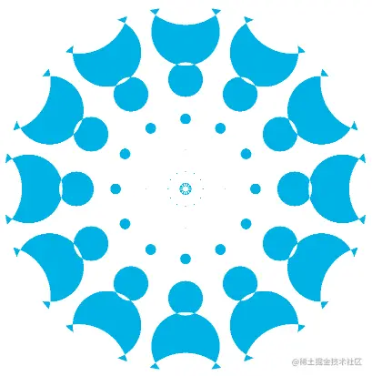

代码如下：

```
<!DOCTYPE html>
<html lang="en">
    <head>
        <meta charset="UTF-8" />
        <title>颜色合成</title>
        <style>
            body {
                margin: 0;
                overflow: hidden;
            }
        </style>
    </head>

    <body>
        <canvas id="canvas"></canvas>
        <!-- 顶点着色器 -->
        <script id="vertexShader" type="x-shader/x-vertex">
            attribute vec4 a_Position;
            void main(){
                 //点位
                 gl_Position=vec4(a_Position.x,a_Position.y,0,1);
                 //尺寸
                 gl_PointSize=a_Position.z;
            }
        </script>
        <!-- 片元着色器 -->
        <script id="fragmentShader" type="x-shader/x-fragment">
            precision mediump float;
            void main(){
                 float dist=distance(gl_PointCoord,vec2(0.5,0.5));
                 if(dist<0.5){
                   gl_FragColor=vec4(0,0.7,0.9,1);
                 }else{
                   discard;
                 }
            }
        </script>
        <script>
            const canvas = document.querySelector('#canvas')
            canvas.width = window.innerWidth
            canvas.height = window.innerHeight

            //三维画笔
            const gl = canvas.getContext('webgl', { stencil: true })
            gl.enable(gl.STENCIL_TEST)

            // 获取着色器文本
            const vsSource = document.querySelector('#vertexShader').innerText
            const fsSource = document.querySelector('#fragmentShader').innerText

            //初始化着色器
            initShaders(gl, vsSource, fsSource)

            // 定义背景色，默认为(0,0,0,0)
            // gl.clearColor(1, 0.95, 0.9, 1.0)
            // 定义模板缓冲区的背景值，默认为0，这不是颜色，就是一个模板参考值
            gl.clearStencil(0)
            // 用定义好的背景色理缓冲区
            gl.clear(gl.COLOR_BUFFER_BIT | gl.STENCIL_BUFFER_BIT)

            //获取attribute 变量
            const a_Position = gl.getAttribLocation(gl.program, 'a_Position')
            //缓冲对象
            const vertexBuffer = gl.createBuffer()
            //绑定缓冲对象
            gl.bindBuffer(gl.ARRAY_BUFFER, vertexBuffer)
            //修改attribute 变量
            gl.vertexAttribPointer(a_Position, 3, gl.FLOAT, false, 0, 0)
            //赋能-批处理
            gl.enableVertexAttribArray(a_Position)
            //清空缓冲区
            gl.bindBuffer(gl.ARRAY_BUFFER, null)

            const drawStencil = DrawStencil()

            const pi2 = Math.PI * 2
            const halfWidth = canvas.width / 2
            const halfHeight = canvas.height / 2
            const r = Math.sqrt(halfWidth * halfWidth + halfHeight * halfHeight)
            const rn = 10
            const rnd = 1 / rn
            const an = 12
            const and = pi2 / an
            const basicSize = Math.min(canvas.width, canvas.height) * 0.35
            const canvasRatio = canvas.width / canvas.height

            !(function ani(time = 0) {
                render(time)
                requestAnimationFrame(ani)
            })()

            function DrawStencil() {
                let first = true
                return function (x, y, size) {
                    if (first) {
                        gl.stencilFunc(gl.ALWAYS, 1, 0xff)
                        gl.stencilOp(gl.KEEP, gl.KEEP, gl.REPLACE)
                    } else {
                        gl.stencilFunc(gl.EQUAL, 1, 0xff)
                        gl.stencilOp(gl.REPLACE, gl.KEEP, gl.INVERT)
                    }
                    gl.bindBuffer(gl.ARRAY_BUFFER, vertexBuffer)
                    gl.bufferData(
                        gl.ARRAY_BUFFER,
                        new Float32Array([x, y, size]),
                        gl.STATIC_DRAW
                    )
                    gl.bindBuffer(gl.ARRAY_BUFFER, null)

                    gl.colorMask(false, false, false, false)
                    gl.drawArrays(gl.POINTS, 0, 1)
                    gl.colorMask(true, true, true, true)
                    first = false
                }
            }

            function drawPoint(x, y, size) {
                gl.stencilFunc(gl.EQUAL, 1, 0xff)
                gl.bindBuffer(gl.ARRAY_BUFFER, vertexBuffer)
                gl.bufferData(
                    gl.ARRAY_BUFFER,
                    new Float32Array([x, y, size]),
                    gl.STATIC_DRAW
                )
                gl.bindBuffer(gl.ARRAY_BUFFER, null)
                gl.drawArrays(gl.POINTS, 0, 1)
            }

            function render(time = 0) {
                for (let j = 0; j < an; j++) {
                    const ang = j * and
                    const c = Math.cos(ang)
                    const s = Math.sin(ang) * canvasRatio
                    for (let i = 0; i < rn; i++) {
                        const x0 = Math.pow(rnd * i, 2)
                        const ratio = i / rn
                        const timeRatio = (Math.sin(time * 0.002 + ratio * pi2) + 1) / 2
                        const size = basicSize * ratio * timeRatio
                        drawStencil(x0 * c, x0 * s, size)
                    }
                }

                drawPoint(0, 0, 800)
            }

            // 初始化着色器
            function initShaders(gl, vsSource, fsSource) {
                //创建程序对象
                const program = gl.createProgram()
                //建立着色对象
                const vertexShader = loadShader(gl, gl.VERTEX_SHADER, vsSource)
                const fragmentShader = loadShader(gl, gl.FRAGMENT_SHADER, fsSource)
                //把顶点着色对象装进程序对象中
                gl.attachShader(program, vertexShader)
                //把片元着色对象装进程序对象中
                gl.attachShader(program, fragmentShader)
                //连接webgl上下文对象和程序对象
                gl.linkProgram(program)
                //启动程序对象
                gl.useProgram(program)
                //将程序对象挂到上下文对象上
                gl.program = program
                return true
            }

            function createProgram(gl, vsSource, fsSource) {
                //创建程序对象
                const program = gl.createProgram()
                //建立着色对象
                const vertexShader = loadShader(gl, gl.VERTEX_SHADER, vsSource)
                const fragmentShader = loadShader(gl, gl.FRAGMENT_SHADER, fsSource)
                //把顶点着色对象装进程序对象中
                gl.attachShader(program, vertexShader)
                //把片元着色对象装进程序对象中
                gl.attachShader(program, fragmentShader)
                //连接webgl上下文对象和程序对象
                gl.linkProgram(program)
                return program
            }

            function loadShader(gl, type, source) {
                //根据着色类型，建立着色器对象
                const shader = gl.createShader(type)
                //将着色器源文件传入着色器对象中
                gl.shaderSource(shader, source)
                //编译着色器对象
                gl.compileShader(shader)
                //返回着色器对象
                return shader
            }
        </script>
    </body>
</html>
```

## 4-模板缓冲区之深度测试

我们之前说模板缓冲区的时候，并没有开启深度测试。

我们可以基于深度测试的成败，设置模板缓冲区如何写入。

代码示例：

```
<!DOCTYPE html>
<html lang="en">
    <head>
        <meta charset="UTF-8" />
        <title>颜色合成</title>
        <style>
            body {
                margin: 0;
                overflow: hidden;
            }
        </style>
    </head>

    <body>
        <canvas id="canvas"></canvas>
        <!-- 顶点着色器 -->
        <script id="vertexShader" type="x-shader/x-vertex">
            attribute vec4 a_Position;
            void main(){
                 //点位
                 gl_Position=vec4(vec3(a_Position),1);
                 //尺寸
                 gl_PointSize=a_Position.w;
            }
        </script>
        <!-- 片元着色器 -->
        <script id="fragmentShader" type="x-shader/x-fragment">
            precision mediump float;
            void main(){
                 float dist=distance(gl_PointCoord,vec2(0.5,0.5));
                 if(dist<0.5){
                   gl_FragColor=vec4(0,0.7,0.9,1);
                 }else{
                   discard;
                 }
            }
        </script>
        <script>
            const canvas = document.querySelector('#canvas')
            canvas.width = window.innerWidth
            canvas.height = window.innerHeight

            //三维画笔
            const gl = canvas.getContext('webgl', { stencil: true })
            gl.enable(gl.STENCIL_TEST)
            gl.enable(gl.DEPTH_TEST)

            // 获取着色器文本
            const vsSource = document.querySelector('#vertexShader').innerText
            const fsSource = document.querySelector('#fragmentShader').innerText

            //初始化着色器
            initShaders(gl, vsSource, fsSource)

            // 定义背景色，默认为(0,0,0,0)
            gl.clearColor(1, 0.95, 0.9, 1.0)
            // 定义模板缓冲区的背景值，默认为0，这不是颜色，就是一个模板参考值
            gl.clearStencil(0)
            gl.clearDepth(1)
            // 用定义好的背景色理缓冲区
            gl.clear(
                gl.COLOR_BUFFER_BIT | gl.STENCIL_BUFFER_BIT | gl.DEPTH_BUFFER_BIT
            )

            //获取attribute 变量
            const a_Position = gl.getAttribLocation(gl.program, 'a_Position')
            //缓冲对象
            const vertexBuffer = gl.createBuffer()
            //绑定缓冲对象
            gl.bindBuffer(gl.ARRAY_BUFFER, vertexBuffer)
            //修改attribute 变量
            gl.vertexAttribPointer(a_Position, 4, gl.FLOAT, false, 0, 0)
            //赋能-批处理
            gl.enableVertexAttribArray(a_Position)
            //清空缓冲区
            gl.bindBuffer(gl.ARRAY_BUFFER, null)

            /* 初始模板 */
            gl.stencilFunc(gl.ALWAYS, 1, 0xff)
            gl.stencilOp(gl.KEEP, gl.KEEP, gl.REPLACE)
            gl.bindBuffer(gl.ARRAY_BUFFER, vertexBuffer)
            gl.bufferData(
                gl.ARRAY_BUFFER,
                new Float32Array([0, 0, 0.5, 200]),
                gl.STATIC_DRAW
            )
            gl.bindBuffer(gl.ARRAY_BUFFER, null)

            gl.colorMask(false, false, false, false)
            gl.drawArrays(gl.POINTS, 0, 1)
            gl.colorMask(true, true, true, true)

            /* 模板2 */
            gl.stencilFunc(gl.ALWAYS, 1, 0xff)
            gl.stencilOp(gl.KEEP, gl.KEEP, gl.INVERT)
            gl.bindBuffer(gl.ARRAY_BUFFER, vertexBuffer)
            gl.bufferData(
                gl.ARRAY_BUFFER,
                new Float32Array([
                    //0.2<0.5通过深度测试
                    0, -0.2, 0.2, 200,
                    //0.8>0.5不通过深度测试
                    0, 0.05, 0.8, 100,
                ]),
                gl.STATIC_DRAW
            )
            gl.bindBuffer(gl.ARRAY_BUFFER, null)

            gl.colorMask(false, false, false, false)
            gl.drawArrays(gl.POINTS, 0, 2)
            gl.colorMask(true, true, true, true)

            // 绘图
            gl.disable(gl.DEPTH_TEST)
            gl.stencilFunc(gl.EQUAL, 1, 0xff)
            gl.bindBuffer(gl.ARRAY_BUFFER, vertexBuffer)
            gl.bufferData(
                gl.ARRAY_BUFFER,
                new Float32Array([0, 0.05, 0.8, 100]),
                gl.STATIC_DRAW
            )
            gl.bindBuffer(gl.ARRAY_BUFFER, null)
            gl.drawArrays(gl.POINTS, 0, 1)

            // 初始化着色器
            function initShaders(gl, vsSource, fsSource) {
                //创建程序对象
                const program = gl.createProgram()
                //建立着色对象
                const vertexShader = loadShader(gl, gl.VERTEX_SHADER, vsSource)
                const fragmentShader = loadShader(gl, gl.FRAGMENT_SHADER, fsSource)
                //把顶点着色对象装进程序对象中
                gl.attachShader(program, vertexShader)
                //把片元着色对象装进程序对象中
                gl.attachShader(program, fragmentShader)
                //连接webgl上下文对象和程序对象
                gl.linkProgram(program)
                //启动程序对象
                gl.useProgram(program)
                //将程序对象挂到上下文对象上
                gl.program = program
                return true
            }

            function createProgram(gl, vsSource, fsSource) {
                //创建程序对象
                const program = gl.createProgram()
                //建立着色对象
                const vertexShader = loadShader(gl, gl.VERTEX_SHADER, vsSource)
                const fragmentShader = loadShader(gl, gl.FRAGMENT_SHADER, fsSource)
                //把顶点着色对象装进程序对象中
                gl.attachShader(program, vertexShader)
                //把片元着色对象装进程序对象中
                gl.attachShader(program, fragmentShader)
                //连接webgl上下文对象和程序对象
                gl.linkProgram(program)
                return program
            }

            function loadShader(gl, type, source) {
                //根据着色类型，建立着色器对象
                const shader = gl.createShader(type)
                //将着色器源文件传入着色器对象中
                gl.shaderSource(shader, source)
                //编译着色器对象
                gl.compileShader(shader)
                //返回着色器对象
                return shader
            }
        </script>
    </body>
</html>
```

效果如下：

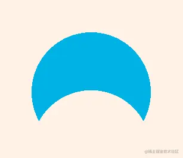

解释一下其逻辑。

1.开启深度测试。

```
gl.enable(gl.DEPTH_TEST)
```

2.建立一个初始模板。

```
gl.stencilFunc(gl.ALWAYS, 1, 0xff)
gl.stencilOp(gl.KEEP, gl.KEEP, gl.REPLACE)
gl.bindBuffer(gl.ARRAY_BUFFER, vertexBuffer)
gl.bufferData(
    gl.ARRAY_BUFFER,
    new Float32Array([0, 0, 0.5, 200]),
    gl.STATIC_DRAW
)
gl.bindBuffer(gl.ARRAY_BUFFER, null)

gl.colorMask(false, false, false, false)
gl.drawArrays(gl.POINTS, 0, 1)
gl.colorMask(true, true, true, true)
```

模板示意图：

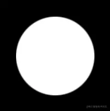

当前模板的深度为0.5。

3.以两个不同深度的图形为模板，与初始模板进行合成。

```
gl.stencilFunc(gl.ALWAYS, 1, 0xff)
gl.stencilOp(gl.KEEP, gl.KEEP, gl.INVERT)
gl.bindBuffer(gl.ARRAY_BUFFER, vertexBuffer)
gl.bufferData(
    gl.ARRAY_BUFFER,
    new Float32Array([
        //0.2<0.5通过深度测试
        0, -0.2, 0.2, 200,
        //0.8>0.5不通过深度测试
        0, 0.05, 0.8, 100,
    ]),
    gl.STATIC_DRAW
)
gl.bindBuffer(gl.ARRAY_BUFFER, null)

gl.colorMask(false, false, false, false)
gl.drawArrays(gl.POINTS, 0, 2)
gl.colorMask(true, true, true, true)
```

模板示意图：

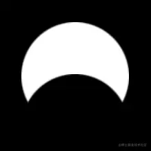

初始模板前面的图形会通过模板测试，所以会取reference的INVERT，即0。

初始模板后面的图形不会通过模板测试，所以会保持模板缓冲区的当前值。

4.关闭模板缓冲区，基于当前模板值，正常绘制一个物体。

```
// 绘图
gl.disable(gl.DEPTH_TEST)
gl.stencilFunc(gl.EQUAL, 1, 0xff)
gl.bindBuffer(gl.ARRAY_BUFFER, vertexBuffer)
gl.bufferData(
    gl.ARRAY_BUFFER,
    new Float32Array([0, 0.05, 0.8, 100]),
    gl.STATIC_DRAW
)
gl.bindBuffer(gl.ARRAY_BUFFER, null)
gl.drawArrays(gl.POINTS, 0, 1)
```

示意图：

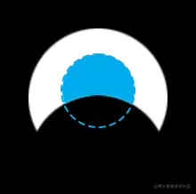

效果如下：


关于模板缓冲区就先说到这，当前以理解原理为主，至于具体的案例实现，我会放到three.js里实现。

## 总结

模板缓冲区使用过程：

1.将模板形状绘制到模板缓冲区，这个过程中通常会禁止写入颜色，模板检测设置为总通过，设置好之后会调用一次绘制，画完后恢复写入颜色缓冲区。

2.重新调整模板检测方法，指明什么情况下通过测试，不再写入模板缓冲区，再进行一次绘制。

我们可以在WebGL渲染管线中对Stencil Test有一个整体认知：

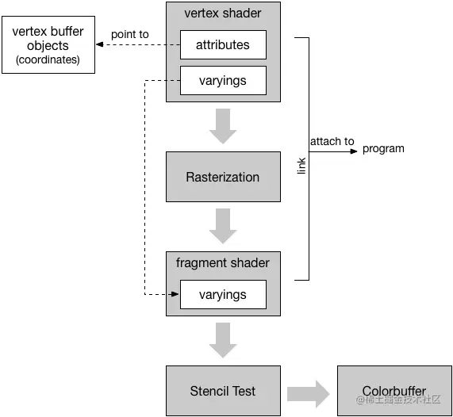

参考链接：

[www.jiazhengblog.com/blog/2016/0…](https://link.juejin.cn/?target=http%3A%2F%2Fwww.jiazhengblog.com%2Fblog%2F2016%2F04%2F05%2F2941%2F "http://www.jiazhengblog.com/blog/2016/04/05/2941/")

[developer.mozilla.org/en-US/docs/…](https://link.juejin.cn/?target=https%3A%2F%2Fdeveloper.mozilla.org%2Fen-US%2Fdocs%2FWeb%2FAPI%2FWebGLRenderingContext%2FstencilFunc%23specifications "https://developer.mozilla.org/en-US/docs/Web/API/WebGLRenderingContext/stencilFunc#specifications")
