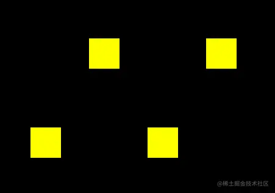
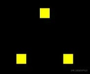

# WebGL 绘制多点

---
源码：[github.com/buglas/webg…](https://link.juejin.cn/?target=https%3A%2F%2Fgithub.com%2Fbuglas%2Fwebgl-lesson "https://github.com/buglas/webgl-lesson")

在webgl 里所有的图形都是由顶点连接而成的，咱们就先画三个可以构成三角形的点。

这里大家还要注意一下，我现在要画的多点是可以被webgl 加工成线、或者面的，这和我们上一篇单纯的想要绘制多个点是不一样的。



### 1-绘制多点的整体步骤

1.  建立着色器源文件
    
    ```
    <script id="vertexShader" type="x-shader/x-vertex">
        attribute vec4 a_Position;
        void main(){
            gl_Position = a_Position;
            gl_PointSize = 20.0;
        }
    </script>
    <script id="fragmentShader" type="x-shader/x-fragment">
        void main(){
            gl_FragColor=vec4(1.0,1.0,0.0,1.0);
        }
    </script>
    ```
    
2.  获取webgl 上下文
    
    ```
    const canvas = document.getElementById('canvas');
    canvas.width=window.innerWidth;
    canvas.height=window.innerHeight;
    const gl = canvas.getContext('webgl');
    ```
    
3.  初始化着色器
    
    ```
    const vsSource = document.getElementById('vertexShader').innerText;
    const fsSource = document.getElementById('fragmentShader').innerText;
    initShaders(gl, vsSource, fsSource);
    ```
    
4.  设置顶点点位
    
    ```
    const vertices=new Float32Array([
        0.0,  0.1,
        -0.1,-0.1,
        0.1, -0.1
    ])
    const vertexBuffer=gl.createBuffer();
    gl.bindBuffer(gl.ARRAY_BUFFER,vertexBuffer);
    gl.bufferData(gl.ARRAY_BUFFER,vertices,gl.STATIC_DRAW);
    const a_Position=gl.getAttribLocation(gl.program,'a_Position');
    gl.vertexAttribPointer(a_Position,2,gl.FLOAT,false,0,0);
    gl.enableVertexAttribArray(a_Position);
    ```
    
5.  清理画布
    
    ```
    gl.clearColor(0.0, 0.0, 0.0, 1.0);
    gl.clear(gl.COLOR_BUFFER_BIT);
    ```
    
6.  绘图
    
    ```
    gl.drawArrays(gl.POINTS, 0, 3);
    ```
    

实际效果：



上面的步骤，主要是先给大家一睹为快，其具体原理，咱们后面细说。

### 2-绘制多点详解

首先咱们先从概念上疏通一下。

我们在用js定点位的时候，肯定是要建立一份顶点数据的，这份顶点数据是给谁的呢？肯定是给着色器的，因为着色器需要这份顶点数据绘图。

然而，我们在js中建立顶点数据，着色器肯定是拿不到的，这是语言不通导致的。

为了解决这个问题，webgl 系统就建立了一个能翻译双方语言的缓冲区。js 可以用特定的方法把数据存在这个缓冲区中，着色器可以从缓冲区中拿到相应的数据。

接下来咱们就看一下这个缓冲区是如何建的，着色器又是如何从其中拿数据的。

1.  建立顶点数据，两个浮点数构成一个顶点，分别代表x、y 值。

```
const vertices=new Float32Array([
    //x    y
    0.0,  0.1, //顶点
    -0.1,-0.1, //顶点
    0.1, -0.1  //顶点
])
```

现在上面的这些顶点数据是存储在js 缓存里的，着色器拿不到，所以咱们需要建立一个着色器和js 都能进入的公共区。

2.  建立缓冲对象。

```
const vertexBuffer=gl.createBuffer();
```

现在上面的这个缓冲区是独立存在的，它只是一个空着的仓库，和谁都没有关系。接下来咱们就让其和着色器建立连接。

3.  绑定缓冲对象。

```
gl.bindBuffer(gl.ARRAY_BUFFER,vertexBuffer);
```

gl.bindBuffer(target,buffer) 绑定缓冲区

-   target 要把缓冲区放在webgl 系统中的什么位置
-   buffer 缓冲区

着色器对象在执行initShaders() 初始化方法的时候，已经被写入webgl 上下文对象gl 中了。

当缓冲区和着色器建立了绑定关系，我们就可以往这块空间写入数据了

4.  往缓冲区对象中写入数据

```
gl.bufferData(gl.ARRAY_BUFFER,vertices,gl.STATIC_DRAW);
```

bufferData(target, data, usage) 将数据写入缓冲区

-   target 要把缓冲区放在webgl 系统中的什么位置
-   data 数据
-   usage 向缓冲区写入数据的方式，咱们在这里先知道 gl.STATIC\_DRAW 方式即可，它是向缓冲区中一次性写入数据，着色器会绘制多次。

现在着色器虽然绑定了缓冲区，可以访问里面的数据了，但是我们还得让着色器知道这个仓库是给哪个变量的，比如咱们这里用于控制点位的attribute 变量。这样做是为了提高绘图效率。

5.  将缓冲区对象分配给attribute 变量

```
const a_Position=gl.getAttribLocation(gl.program,'a_Position');
gl.vertexAttribPointer(a_Position,2,gl.FLOAT,false,0,0);
```

gl.vertexAttribPointer(local,size,type,normalized,stride,offset) 将缓冲区对象分配给attribute 变量

-   local attribute变量
-   size 顶点分量的个数，比如我们的vertices 数组中，两个数据表示一个顶点，那咱们就写2
-   type 数据类型，比如 gl.FLOAT 浮点型
-   normalized 是否将顶点数据归一
-   stride 相邻两个顶点间的字节数，我的例子里写的是0，那就是顶点之间是紧挨着的
-   offset 从缓冲区的什么位置开始存储变量，我的例子里写的是0，那就是从头开始存储变量

到了这里，着色就知道缓冲区的数据是给谁的了。因为咱们缓冲区里的顶点数据是数组，里面有多个顶点。所以我们得开启一个让着色器批量处理顶点数据的属性。默认着色器只会一个一个的接收顶点数据，然后一个一个的绘制顶点。

6.  开启顶点数据的批处理功能。

```
gl.enableVertexAttribArray(a_Position);
```

-   location attribute变量

好啦，现在已经是万事俱备，只欠绘图了。

7.  绘图

```
gl.clearColor(0.0, 0.0, 0.0, 1.0);
gl.clear(gl.COLOR_BUFFER_BIT);
gl.drawArrays(gl.POINTS, 0, 3);
```

drawArrays(mode,first,count)

-   mode 绘图模式，比如 gl.POINTS 画点
-   first 从哪个顶点开始绘制
-   count 要画多少个顶点

关于绘制多点，我就说到这，接下来咱们说一下基于多点绘制图形。
