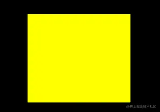

# WebGL 绘制图形

---
源码：[github.com/buglas/webg…](https://link.juejin.cn/?target=https%3A%2F%2Fgithub.com%2Fbuglas%2Fwebgl-lesson "https://github.com/buglas/webgl-lesson")

在数学中，我们知道，三个点可以确定一个唯一的三角面。接下来咱们画一下。

### 1-绘制三角面

我们在之前绘制多点的基础上做一下修改。

1.  顶点着色器中的gl\_PointSize = 20.0 不要，因为这个属性是控制顶点大小的，咱们已经不需要显示顶点了。

```
<script id="vertexShader" type="x-shader/x-vertex">
    attribute vec4 a_Position;
    void main(){
        gl_Position = a_Position;
        //gl_PointSize = 20.0;
    }
</script>
```

2.  在js 中修改绘图方式

```
// gl.drawArrays(gl.POINTS, 0, 3);
gl.drawArrays(gl.TRIANGLES, 0, 3);
```

上面的gl.TRIANGLES 就是绘制三角面的意思。

看一下效果：


webgl 既然可以画面了，那它是否可以画线呢，这个是必须可以，我们可以在gl.drawArrays() 方法的第一个参数里进行设置。

### 2-基本图形

gl.drawArrays(mode,first,count) 方法可以绘制一下图形：

-   POINTS 可视的点
-   LINES 单独线段
-   LINE\_STRIP 线条
-   LINE\_LOOP 闭合线条
-   TRIANGLES 单独三角形
-   TRIANGLE\_STRIP 三角带
-   TRIANGLE\_FAN 三角扇

上面的POINTS 比较好理解，就是一个个可视的点。

线和面的绘制方式各有三种，咱们接下来就详细说一下。

#### 2-1-点的绘制

POINTS 可视的点


上面六个点的绘制顺序是：v0, v1, v2, v3, v4, v5

#### 2-2-线的绘制

1.  LINES 单独线段


 上面三条有向线段的绘制顺序是：

 v0>v1

 v2>v3

 v4>v5

2.  LINE\_STRIP 线条


 上面线条的绘制顺序是：v0>v1>v2>v3>v4>v5

3.  LINE\_LOOP 闭合线条


 上面线条的绘制顺序是：v0>v1>v2>v3>v4>v5>v0

#### 2-3-面的绘制

对于面的绘制，我们首先要知道一个原理：

-   面有正反两面。
-   面向我们的面，如果是正面，那它必然是逆时针绘制的；
-   面向我们的面，如果是反面，那它必然是顺时针绘制的；

接下来，咱们看一下面的三种绘制方式：

1.  TRIANGLES 单独三角形


 上面两个面的绘制顺序是：

 v0>v1>v2

 v3>v4>v5

2.  TRIANGLE\_STRIP 三角带


上面四个面的绘制顺序是：

v0>v1>v2

以上一个三角形的第二条边+下一个点为基础，以和第二条边相反的方向绘制三角形

v2>v1>v3

以上一个三角形的第三条边+下一个点为基础，以和第二条边相反的方向绘制三角形

v2>v3>v4

以上一个三角形的第二条边+下一个点为基础，以和第二条边相反的方向绘制三角形

v4>v3>v5

规律：

第一个三角形：v0>v1>v2

第偶数个三角形：以上一个三角形的第二条边+下一个点为基础，以和第二条边相反的方向绘制三角形

第奇数个三角形：以上一个三角形的第三条边+下一个点为基础，以和第二条边相反的方向绘制三角形

3.  TRIANGLE\_FAN 三角扇


 上面四个面的绘制顺序是：

 v0>v1>v2

以上一个三角形的第三条边+下一个点为基础，按照和第三条边相反的顺序，绘制三角形

 v0>v2>v3

以上一个三角形的第三条边+下一个点为基础，按照和第三条边相反的顺序，绘制三角形

 v0>v3>v4

以上一个三角形的第三条边+下一个点为基础，按照和第三条边相反的顺序，绘制三角形

 v0>v4>v5

关于webgl 可以绘制的基本图像就说到这，接下来咱们画个矩形面，练一下手。

### 3-实例：绘制矩形面

首先，我们要知道，webgl 可以绘制的面只有三角面，所以咱们要绘制矩形面的话，只能用两个三角形去拼。

接下咱们就说一下如何用三角形拼矩形。

#### 4-1-三角形拼矩形的方法

我们可以用TRIANGLE\_STRIP 三角带拼矩形。

下面的两个三角形分别是：

v0>v1>v2

v2>v1>v3


#### 4-2-代码实现

1.  建立顶点数据

```
const vertices=new Float32Array([
    -0.2, 0.2,
    -0.2,-0.2,
    0.2, 0.2,
    0.2,-0.2,
])
```

上面两个浮点代表一个顶点，依次是v0、v1、v2、v3，如上图所示。

2.  绘图

```
gl.drawArrays(gl.TRIANGLE_STRIP, 0, 4);
```

上面参数的意思分别是：三角带、从第0个顶点开始画、画四个。

效果如下：



关于矩形的绘制就这么简单，接下来咱们可以去尝试其它的图形。

比如：把TRIANGLE\_STRIP 三角带变成TRIANGLE\_FAN 扇形

```
gl.drawArrays(gl.TRIANGLE_FAN, 0, 4);
```

画出了一个三角带的样子：


其绘图顺序是：

v0>v1>v2

v0>v2>v3


关于基本图形的绘制，咱们就说到这。
