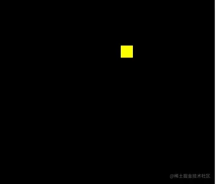

# WebGL 异步绘制多点

---
源码：[github.com/buglas/webg…](https://link.juejin.cn/?target=https%3A%2F%2Fgithub.com%2Fbuglas%2Fwebgl-lesson "https://github.com/buglas/webgl-lesson")

在项目实战的时候，用户交互事件是必不可少的。因为事件是异步的，所以我们在绘图的时候，必须要考虑异步绘图。

接下来我通过一个例子来说一下异步绘制多点的方法。

### 1-异步绘制线段



1.顶点着色器和片元着色器

```
<!-- 顶点着色器 -->
<script id="vertexShader" type="x-shader/x-vertex">
      attribute vec4 a_Position;
      void main(){
          gl_Position=a_Position;
          gl_PointSize=20.0;
      }
</script>
<!-- 片元着色器 -->
<script id="fragmentShader" type="x-shader/x-fragment">
      void main(){
          gl_FragColor=vec4(1,1,0,1);
      }
</script>
```

2.初始化着色器

```
import { initShaders } from "../jsm/Utils.js";

const canvas = document.querySelector("#canvas");
canvas.width = window.innerWidth;
canvas.height = window.innerHeight;

// 获取着色器文本
const vsSource = document.querySelector("#vertexShader").innerText;
const fsSource = document.querySelector("#fragmentShader").innerText;

//三维画笔
const gl = canvas.getContext("webgl");

//初始化着色器
initShaders(gl, vsSource, fsSource);
```

3.建立缓冲对象，并将其绑定到webgl 上下文对象上，然后向其中写入顶点数据。将缓冲对象交给attribute变量，并开启attribute 变量的批处理功能。

```
//顶点数据
let points=[0, 0.2]
//缓冲对象
const vertexBuffer = gl.createBuffer();
//绑定缓冲对象
gl.bindBuffer(gl.ARRAY_BUFFER, vertexBuffer);
//写入数据
gl.bufferData(gl.ARRAY_BUFFER,new Float32Array(points),gl.STATIC_DRAW)
//获取attribute 变量
const a_Position=gl.getAttribLocation(gl.program, 'a_Position')
//修改attribute 变量
gl.vertexAttribPointer(a_Position, 2, gl.FLOAT, false, 0, 0)
//赋能-批处理
gl.enableVertexAttribArray(a_Position)
```

4.刷底色并绘制顶点

```
//声明颜色 rgba
gl.clearColor(0, 0, 0, 1);
//刷底色
gl.clear(gl.COLOR_BUFFER_BIT);
//绘制顶点
gl.drawArrays(gl.POINTS, 0, 1);
```

5.一秒钟后，向顶点数据中再添加的一个顶点，修改缓冲区数据，然后清理画布，绘制顶点

```
setTimeout(()=>{
  points.push(-0.2,-0.1)
  gl.bufferData(gl.ARRAY_BUFFER,new Float32Array(points),gl.STATIC_DRAW)
  gl.clear(gl.COLOR_BUFFER_BIT);
  gl.drawArrays(gl.POINTS, 0, 2);
},1000)
```

6.两秒钟后，清理画布，绘制顶点，绘制线条

```
setTimeout(()=>{
    gl.clear(gl.COLOR_BUFFER_BIT);
    gl.drawArrays(gl.POINTS, 0, 2);
    gl.drawArrays(gl.LINE_STRIP, 0, 2);
},2000)
```

总结一下上面的原理，当缓冲区被绑定在了webgl 上下文对象上后，我们在异步方法里直接对其进行修改即可，顶点着色器在绘图的时候会自动从其中调用数据。

WebGLBuffer缓冲区中的数据在异步方法里不会被重新置空。

理解了异步绘图原理后，我们还可以对这种图形的绘制进行一个简单的封装。

### 2-封装多边形对象

建立一个Poly 对象，这个对象是辅助我们理解这一篇的知识的，没做太深层次的考量，因为有的知识点我们还没有讲到。

```
const defAttr=()=>({
  gl:null,
  vertices:[],
  geoData:[],
  size:2,
  attrName:'a_Position',
  count:0,
  types:['POINTS'],
})
export default class Poly{
  constructor(attr){
    Object.assign(this,defAttr(),attr)
    this.init()
  }
  init(){
    const {attrName,size,gl}=this
    if(!gl){return}
    const vertexBuffer = gl.createBuffer()
    gl.bindBuffer(gl.ARRAY_BUFFER, vertexBuffer)
    this.updateBuffer()
    const a_Position=gl.getAttribLocation(gl.program,attrName)
    gl.vertexAttribPointer(a_Position, size, gl.FLOAT, false, 0, 0)
    gl.enableVertexAttribArray(a_Position)
  }
  addVertice(...params){
    this.vertices.push(...params)
    this.updateBuffer()
  }
  popVertice(){
    const {vertices,size}=this
    const len=vertices.length
    vertices.splice(len-size,len)
    this.updateCount()
  }
  setVertice(ind,...params){
    const {vertices,size}=this
    const i=ind*size
    params.forEach((param,paramInd)=>{
      vertices[i+paramInd]=param
    })
  }
  updateBuffer(){
    const {gl,vertices}=this
    this.updateCount()
    gl.bufferData(gl.ARRAY_BUFFER,new Float32Array(vertices),gl.STATIC_DRAW)
  }
  updateCount(){
    this.count=this.vertices.length/this.size
  }
  updateVertices(params){
    const {geoData}=this
    const vertices=[]
    geoData.forEach(data=>{
      params.forEach(key=>{
        vertices.push(data[key])
      })
    })
    this.vertices=vertices
  }
  draw(types=this.types){
    const {gl,count}=this
    for(let type of types){
      gl.drawArrays(gl[type],0,count);
    }
  }
}
```

属性：

-   gl webgl上下文对象
    
-   vertices 顶点数据集合，在被赋值的时候会做两件事
    
    -   更新count 顶点数量，数据运算尽量不放渲染方法里
    -   向缓冲区内写入顶点数据
-   geoData 模型数据，对象数组，可解析出vertices 顶点数据
    
-   size 顶点分量的数目
    
-   positionName 代表顶点位置的attribute 变量名
    
-   count 顶点数量
    
-   types 绘图方式，可以用多种方式绘图
    

方法

-   init() 初始化方法，建立缓冲对象，并将其绑定到webgl 上下文对象上，然后向其中写入顶点数据。将缓冲对象交给attribute变量，并开启attribute 变量的批处理功能。
-   addVertice() 添加顶点
-   popVertice() 删除最后一个顶点
-   setVertice() 根据索引位置设置顶点
-   updateBuffer() 更新缓冲区数据，同时更新顶点数量
-   updateCount() 更新顶点数量
-   updateVertices() 基于geoData 解析出vetices 数据
-   draw() 绘图方法

接下来就可以用Poly 对象实现之前的案例了。

```
const poly=new Poly({
  gl,
  vertices:[0, 0.2]
})
poly.draw(['POINTS'])

setTimeout(()=>{
  poly.addVertice(-0.2,-0.1)
  gl.clear(gl.COLOR_BUFFER_BIT);
  poly.draw(['POINTS'])
},1000)

setTimeout(()=>{
  gl.clear(gl.COLOR_BUFFER_BIT);
  poly.draw(['POINTS','LINE_STRIP'])
},2000)
```

异步绘图原理跑通了，我们也就可以用鼠标绘制线条了。

```
//实例化多边形
const poly=new Poly({
    gl,
    types:['POINTS','LINE_STRIP']
})

// 鼠标点击事件
canvas.addEventListener("click", (event) => {
    const {x,y}=getMousePosInWebgl(event,canvas)
    poly.addVertice(x,y)
    gl.clear(gl.COLOR_BUFFER_BIT);
    poly.draw()
});
```

当前我们所能画的是一条线条，如果我们想要绘制多条线呢？就比如我们要画一个狮子座。


### 3-绘制多线

既然是多线，那就需要有个容器来承载它们，这样方便管理。

#### 3-1-建立容器对象

建立一个Sky 对象，作为承载多边形的容器。

```
export default class Sky{
  constructor(gl){
    this.gl=gl
    this.children=[]
  }
  add(obj){
    obj.gl=this.gl
    this.children.push(obj)
  }
  updateVertices(params){
    this.children.forEach(ele=>{
      ele.updateVertices(params)
    })
  }
  draw(){
    this.children.forEach(ele=>{
      ele.init()
      ele.draw()
    })
  }
}
```

属性：

-   gl webgl上下文对象
-   children 子级

方法：

-   add() 添加子对象
-   updateVertices() 更新子对象的顶点数据
-   draw() 遍历子对象绘图，每个子对象对应一个buffer 对象，所以在子对象绘图之前要先初始化。

#### 3-2-示例

想象一个场景：鼠标点击画布，绘制多边形路径。鼠标右击，取消绘制。鼠标再次点击，绘制新的多边形。


代码如下：

```
//夜空
const sky=new Sky(gl)
//当前正在绘制的多边形
let poly=null

//取消右击提示
canvas.oncontextmenu = function(){
    return false;
}
// 鼠标点击事件
canvas.addEventListener("mousedown", (event) => {
    if(event.button===2){
        popVertice()
    }else{
        const {x,y}=getMousePosInWebgl(event,canvas)
        if(poly){
            poly.addVertice(x,y)
        }else{
            crtPoly(x,y)
        }
    }
    render()
});
//鼠标移动
canvas.addEventListener("mousemove", (event) => {
    if(poly){
        const {x,y}=getMousePosInWebgl(event,canvas)
        poly.setVertice(poly.count-1,x,y)
        render()
    }
});

//删除最后一个顶点
function popVertice(){
    poly.popVertice()
    poly=null
}
//创建多边形
function crtPoly(x,y){
    poly=new Poly({
        vertices:[x,y,x,y],
        types:['POINTS','LINE_STRIP']
    })
    sky.add(poly)
}
// 渲染方法
function render(){
    gl.clear(gl.COLOR_BUFFER_BIT)
    sky.draw()
}
```
